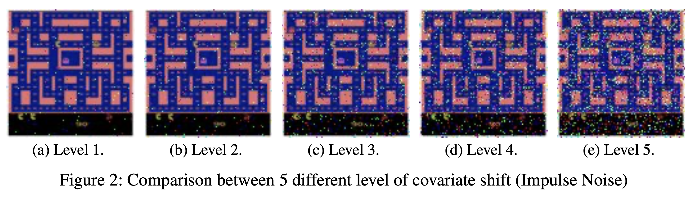
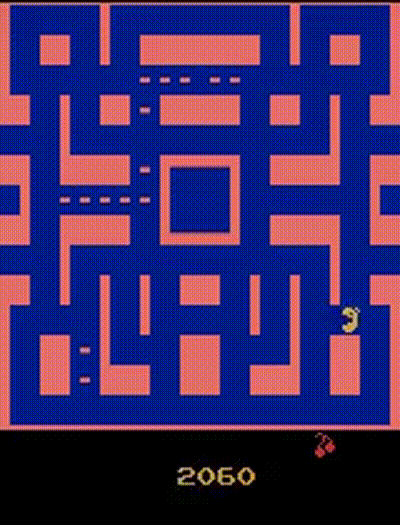

# AdaDQN : Adaptive DQN: Enhancing Performance of Deep Q-Networks through Test-Time Adaptation in the Face of Covariate Shift
[[`Slides`](https://docs.google.com/presentation/d/1QPD_oB8fpxoR_DN_qp9bD6wKi6mIfVRLn5bZUcjmzjE/edit?usp=sharing)]
[[`Paper`](https://github.com/s6007541/AdaDQN/blob/main/pdf_files/AdaDQN.pdf)] 

## Abstract
Deep Q-Learning (DQN) has achieved remarkable performance in various domains, but its effectiveness is often limited when the distributions of input at training and testing time are misaligned. This phenomenon, known as domain shift or covariate shift, is prevalent in real-world scenarios where unexpected environmental changes and noises result in poor model performance. For instance, in autonomous driving, weather conditions can change rapidly, creating such misalignment. To address this challenge, we proposed Adaptive DQN (AdaDQN), the very first DQN algorithm with test-time adaptation (TTA) to mitigate the performance degradation of DQN during testing in the presence of covariate shift. We evaluate AdaDQN using several environments from the Arcade Learning Environemnt, a framework consisting of Atari 2600 games. We found that standard DQN degrades significantly under covariate shift, while our proposed AdaDQN can recover degraded DQN using only unlabeled test data.

This repository was implemented on top of the DQN algorithm introduced by Mnih et al. in the paper [Playing Atari with Deep Reinforcement Learning](https://www.cs.toronto.edu/~vmnih/docs/dqn.pdf), combines Q-learning with deep neural networks to achieve impressive results in a variety of Atari 2600 games.

## Overview

### Deep Q-Network (DQN)

The Deep Q-Network (DQN) is a sophisticated reinforcement learning algorithm that adapts Q-learning to manage complex state spaces with high dimensions. By utilizing a neural network, it estimates the Q-function, capturing the anticipated total rewards when making a particular move within a specific state. This neural network approach enables DQN to glean insights directly from unprocessed sensory inputs, expanding its usability across a diverse array of tasks.

### Atari Games

The Atari 2600, a widely embraced home gaming console during the late 1970s and early 1980s, offered a broad spectrum of games. These games stand as a standard for evaluating the effectiveness of reinforcement learning algorithms. Within the Atari 2600 suite, each game presents a distinct environment, offering varied challenges and serving as an optimal platform for training agents to adapt and excel across a multitude of tasks.

### Covariate Shift


We define covariate shift in reinforcement learning as the situation when the distribution of states or observations encountered by an agent during training diverges from those experienced during testing or deployment. This discrepancy can stem from differences between the training and testing environments, where the agent’s learned knowledge might not generalize well to novel or unseen states, leading to suboptimal performance. Moreover, non-stationarity within the environment, such as changes occurring over time, can also cause shifts in state distributions. Handling covariate shift in RL involves strategies to ensure adaptability to varying distributions, including techniques like experience replay to enable learning from diverse data samples, employing algorithms robust to environmental changes, or leveraging transfer learning and domain adaptation methodologies to help the agent adapt to new or evolving states and observations encountered during testing phases, ultimately aiming to enhance the agent’s ability to generalize across different environments and distributions.

Here are examples from `MS PacMan` environment with covariate shifts:

<!-- 
 -->

## Table of Contents

- [Introduction](#introduction)
- [Overview](#overview)
- [Getting Started](#getting-started)
  - [Prerequisites](#prerequisites)
  - [Installation](#installation)
- [Usage](#usage)
- [Training](#training)
- [Evaluation](#evaluation)
- [Results](#results)
- [Contributing](#contributing)

## Getting Started

### Prerequisites

To run this project, you will need the following:

- Python 3.x
- PyTorch
- Gym (OpenAI)

### Installation

1. Clone the repository:

```bash
git clone https://github.com/s6007541/AdaDQN.git
```

2. Create conda environment

```bash
conda create --name adadqn python=3.9
```

3. Activate environment

```bash
conda activate adadqn
```

4. Install the required dependencies:

```bash
pip install -r requirements.txt
```

## Usage

To train and evaluate the DQN agent, follow the steps outlined below:

1. Set up the required dependencies as described in the [Installation](#installation) section.

2. Train the DQN agent:

```bash
sh run_train.sh
```

If you want to change the game that you train, please edit the game environment name in `run_train.sh` file.

3. Evaluate the trained agent:

```bash
sh run_eval.sh
```

If you want to change the game that you eval, please edit the game environment name in `run_eval.sh` file.

3. Print summary of the results as csv file

```bash
python csv_create.py
```

If you want to change the game to print the csv, please edit the game environment name in `csv_create.py` file.

## Training

The training process involves the following steps:

1. Preprocess raw game frames to reduce dimensionality.
2. Initialize a deep neural network to approximate the Q-function.
3. Initialize a replay buffer to store experiences.
4. For each episode, perform the following steps:
   - Select an action using an epsilon-greedy policy.
   - Execute the action in the environment and observe the next state, reward, and terminal flag.
   - Store the experience in the replay buffer.
   - Sample a batch of experiences from the replay buffer and perform a Q-learning update step.
   - Update the target Q-network periodically.

## Evaluation under Covariate Shift

The evaluation process involves testing the trained DQN agent on the environment with covariate shift. There are 15 types of covariate shifts and 5 level of shifts from weak (level 1) to strong (level 5). The agent's performance is measured in terms of the average score achieved over a specified number of episodes.

<!-- ## Results -->

<!-- ### Game: `MS PacMan` -->

<!-- Here's a GIF of the agent playing `MS PacMan`:

 -->


## Acknowledgment
This repository inspired by CleanRL
```
@article{huang2022cleanrl,
  author  = {Shengyi Huang and Rousslan Fernand Julien Dossa and Chang Ye and Jeff Braga and Dipam Chakraborty and Kinal Mehta and João G.M. Araújo},
  title   = {CleanRL: High-quality Single-file Implementations of Deep Reinforcement Learning Algorithms},
  journal = {Journal of Machine Learning Research},
  year    = {2022},
  volume  = {23},
  number  = {274},
  pages   = {1--18},
  url     = {http://jmlr.org/papers/v23/21-1342.html}
}
```
